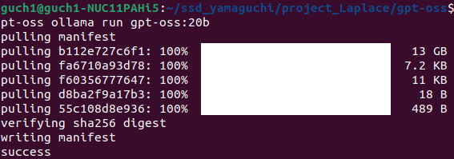

### 環境構築
docker-compose.ymlがあるディレクトリで
```
docker compose up -d
```
を実行して
```
docker ps
```
でコンテナが起動していることを確認する。
```
bash llm_install_to_container.sh
```
を実行してインストールしたいモデル名を入力する。
これで以下の画像のようにsuccessが表示されればインストール完了。 \


### エラー1 ポート番号の競合
```
guch1@guch1-NUC11PAHi5:~/ssd_yamaguchi/project_Laplace/gpt-oss$ docker compose up -d
[+] Running 1/2
 ✔ Network gpt-oss_default   Created                                               0.1s 
 ⠦ Container ollama-gpt-oss  Starting                                              0.7s 
Error response from daemon: failed to set up container networking: driver failed programming external connectivity on endpoint ollama-gpt-oss (8aa985998ab5b5ab6b8b133b96d193bf065b312cea012205285691331904b3a0): failed to bind host port for 0.0.0.0:11434:172.20.0.2:11434/tcp: address already in use
```
指定したポート番号(この例だと11434)が既に使用されている場合に発生。　\
 **そもそもポート番号を変更してしまえばこの問題は解決する。** こちらのがおすすめ。 \
どうしても変更できない場合、競合している元を止めることで解決するが止めたことによる弊害は不明。ﾕﾙｼﾃ。　\
競合元を調べて止める方法は、
```
sudo lsof -i :11434
```
実行すると
```
guch1@guch1-NUC11PAHi5:~/ssd_yamaguchi/project_Laplace/gpt-oss$ sudo lsof -i :11434
[sudo] guch1 のパスワード: 
COMMAND  PID   USER   FD   TYPE DEVICE SIZE/OFF NODE NAME
ollama  1673 ollama    3u  IPv4  14493      0t0  TCP localhost:11434 (LISTEN)
```
のような出力が出る。こいつが原因。この例では既にollamaがホストのPCでポートを使用していた。
よって殺す。
```
sudo systemctl stop ollama
```
stopのあとは```sudo lsof -i :11434```で確認したCOMMANDの内容が入る。今回はollamaだった。